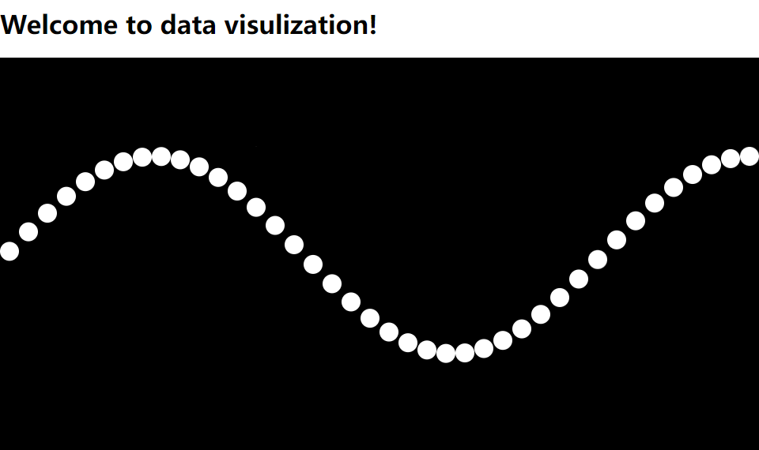

# Data Visualization Playground

## dv-main

Use `d3.js` and `React.js` to build data visualizations.

[Data Visualization with D3, JavaScript, React - Full Course](https://www.youtube.com/watch?v=2LhoCfjm8R4&t=12467s)

```
cd dv-main
npm i
npm start
```

### Smile face

Use svg cricle and path to draw a smile face.


### Interactive cricle

Use mouse event and react `useState` hook to let circle move with mouse.


### World population bar chart

Visualizae 2020 world population with bar chart.

[Data Source: UN]()


### Petal scatter


### Time series and line chart

Tempertue information via time of your city.

[Data Source: Data Canvas: Sense Your City](https://grayarea.org/initiative/data-canvas-sense-your-city/)


### Geo chart

Note: topojson, geojson, etc.

[Data Source 1: World Atlas](https://github.com/topojson/world-atlas)


### Scatter chart with menu

[MDN select](https://developer.mozilla.org/en-US/docs/Web/HTML/Element/select)


## Others

### Sine wave

Movavle sine wave with d3 api.

